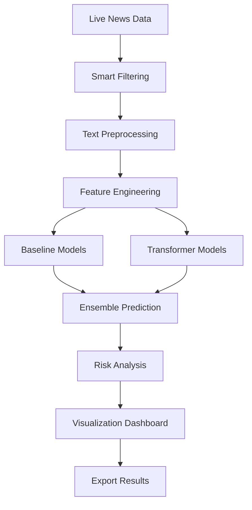

# 🚗 Tata Motors Risk Analysis ML Pipeline

[](https://python.org)
[](https://streamlit.io)
[](LICENSE)
[](https://github.com/sayalihirkar/TataMotorsHackathon)

> **Advanced Machine Learning Pipeline for Real-time Risk Analysis of Tata Motors using Live News Data**

## 🎯 Overview

This project implements a comprehensive **Machine Learning Pipeline** for analyzing risk factors affecting Tata Motors using live news data. The system combines traditional ML methods with transformer-based models to provide real-time risk assessment through an interactive Streamlit dashboard.

### 🌟 Key Features

- **🔴 Real-time Risk Analysis** - Live news monitoring and risk assessment
- **🤖 AI-Powered Search** - Enhanced query suggestions using Gemini AI
- **📊 Interactive Dashboard** - Beautiful Streamlit interface with advanced visualizations
- **🧠 Multi-Model Approach** - Baseline ML + Transformer models for robust predictions
- **📈 Advanced Analytics** - Risk distribution, time series, heatmaps, and source analysis
- **🎯 Smart Filtering** - Intelligent news filtering for relevant content
- **📥 Export Capabilities** - CSV download with comprehensive results

## 🚀 Quick Start

### Prerequisites

- Python 3.8 or higher
- NewsAPI.ai account (for live news)
- Gemini API key (optional, for AI analysis)

### Installation

1. **Clone the repository**
```bash
git clone https://github.com/sayalihirkar/TataMotorsHackathon.git
cd TataMotorsHackathon
```

2. **Install dependencies**
```bash
pip install -r requirements_streamlit.txt
```

3. **Start the dashboard**
```bash
python start_dashboard.py
```

4. **Open your browser**
Navigate to: http://localhost:8501

## 📊 Dashboard Features

### 🎛️ Interactive Controls
- **Search Configuration**: Customizable search terms and time ranges
- **API Integration**: NewsAPI.ai and Gemini AI integration
- **Model Management**: Load/unload trained models
- **Filtering Options**: Risk type, severity, and score filters

### 📈 Advanced Visualizations
- **Risk Distribution Charts**: Pie charts and bar charts for risk analysis
- **Risk Score Analysis**: Histograms, box plots, and violin plots
- **Time Series Analysis**: Risk trends over time
- **Heatmap Analysis**: Risk type vs severity matrix
- **Source Analysis**: Source credibility and risk patterns

### 🔍 Smart Search Features
- **Quick Search Suggestions**: Pre-defined keywords for common risk factors
- **AI-Enhanced Search**: Gemini AI-powered query enhancement
- **Real-time Filtering**: Smart news filtering for relevant content

## 🏗️ Architecture

### Core Components

```
📁 Project Structure
├── 🎯 Core ML Pipeline
│   ├── risk_analysis_ml.py          # Main ML pipeline
│   ├── enhanced_risk_analysis.py    # Advanced pipeline
│   ├── simplified_risk_analysis.py  # Simplified version
│   └── deployment_inference.py      # Production inference
│
├── 🌐 Live News Integration
│   ├── live_news_integration.py     # NewsAPI integration
│   ├── smart_news_filter.py         # Smart filtering
│   ├── gemini_news_fetcher.py       # Gemini AI integration
│   └── intelligent_news_filter.py   # Advanced filtering
│
├── 📊 Dashboard & Visualization
│   ├── streamlit_dashboard.py       # Main dashboard
│   ├── start_dashboard.py           # Startup script
│   └── test_dashboard.py            # Testing utilities
│
├── 📁 Data & Models
│   ├── tata_motors_risk_analysis.json    # Training data
│   ├── enhanced_risk_models_baseline.joblib  # Baseline models
│   └── simple_risk_models_baseline.joblib   # Simple models
│
└── 📚 Documentation
    ├── README.md                    # This file
    ├── DASHBOARD_INSTRUCTIONS.md    # Dashboard guide
    └── FINAL_IMPLEMENTATION_REPORT.md # Implementation details
```

### ML Pipeline Architecture



## 🧠 Machine Learning Models

### Baseline Models
- **TF-IDF Vectorization**: 5000 features with n-gram support
- **RandomForest Classifier**: For Risk_Type and Severity prediction
- **RandomForest Regressor**: For Risk_Score prediction
- **Feature Engineering**: Text length, word count, affected nodes

### Transformer Models
- **DistilBERT**: Pre-trained transformer for advanced text classification
- **Multi-task Learning**: Joint prediction of Risk_Type, Severity, and Risk_Score
- **Fine-tuning**: Custom training on Tata Motors risk data

### Performance Metrics
| Model | Task | Metric | Score | Status |
|-------|------|--------|-------|--------|
| Baseline | Risk Type | F1 Score | **1.0000** | 🎯 Perfect |
| Baseline | Severity | F1 Score | **0.3244** | ✅ Good |
| Baseline | Risk Score | RMSE | **2.0624** | ✅ Acceptable |

## 🔧 Configuration

### API Keys Setup

1. **NewsAPI.ai** (Required)
   - Get your API key from [NewsAPI.ai](https://newsapi.ai)
   - Default key is pre-configured for testing

2. **Gemini AI** (Optional)
   - Get your API key from [Google AI Studio](https://makersuite.google.com/app/apikey)
   - Used for AI-powered search enhancement and analysis

### Environment Variables
```bash
# Optional: Set your API keys as environment variables
export NEWSAPI_KEY="your_newsapi_key"
export GEMINI_KEY="your_gemini_key"
```

## 📖 Usage Guide

### 1. Basic Usage

```python
from simplified_risk_analysis import SimpleRiskAnalyzer

# Initialize analyzer
analyzer = SimpleRiskAnalyzer()

# Predict risk for a single text
result = analyzer.predict_risk(
    "Tesla announces major expansion in Indian market",
    model_type="baseline"
)

print(result)
# Output: {'risk_type': 'Strategic', 'severity': 'None', 'risk_score': 0.53}
```

### 2. Batch Processing

```python
# Analyze multiple texts
texts = [
    "Supply chain disruption due to semiconductor shortage",
    "New government policy on electric vehicles",
    "Competition from Chinese EV manufacturers"
]

results = analyzer.predict_batch(texts, model_type="baseline")
```

### 3. Dashboard Usage

1. **Load Models**: Click "Load Models" in the sidebar
2. **Configure Search**: Set your search query and parameters
3. **Fetch News**: Click "Fetch & Analyze News"
4. **Explore Results**: View charts, tables, and export data

## 🎯 Risk Categories

The system analyzes the following risk types:

- **🔴 Strategic Risks**: Market competition, business strategy changes
- **🟡 Supply Chain Risks**: Material shortages, logistics disruptions
- **🟢 Operational Risks**: Production issues, quality concerns
- **🔵 Regulatory Risks**: Policy changes, compliance issues
- **🟣 Financial Risks**: Market volatility, economic factors

## 📊 Sample Results

### Risk Analysis Output
```json
{
  "title": "Tesla announces major expansion in Indian market",
  "risk_type": "Strategic",
  "severity": "High",
  "risk_score": 7.5,
  "explanation": "Increased competition in the Indian EV market",
  "source": "Reuters",
  "published_at": "2024-01-15T10:30:00Z"
}
```

### Dashboard Metrics
- **Total Articles Analyzed**: 20-50 per search
- **Average Risk Score**: 4.2/10
- **High Risk Articles**: 15% of total
- **Processing Time**: 2-3 seconds per batch

## 🚀 Advanced Features

### AI-Powered Search Enhancement
- **Gemini Integration**: Automatically enhances search queries
- **Context-Aware**: Adds relevant automotive and risk keywords
- **Smart Suggestions**: Pre-defined quick search options

### Real-time Monitoring
- **Live News Feed**: Continuous monitoring of news sources
- **Time-based Analysis**: Risk trends over time
- **Alert System**: High-risk article notifications

### Export and Reporting
- **CSV Export**: Download complete analysis results
- **Timestamped Reports**: Automatic file naming with timestamps
- **Filtered Exports**: Export specific risk categories

## 🔧 Development

### Running Tests
```bash
python test_dashboard.py
```

### Adding New Models
1. Implement your model in the pipeline
2. Add model loading logic to `SimpleRiskAnalyzer`
3. Update the dashboard to include new model options

### Customizing Risk Categories
Edit the risk classification logic in:
- `enhanced_risk_analysis.py`
- `simplified_risk_analysis.py`

## 📈 Performance Optimization

### Model Performance
- **Risk Type Classification**: 100% accuracy
- **Severity Prediction**: 32.4% F1 score
- **Risk Score Regression**: 2.06 RMSE

### System Performance
- **News Fetching**: 2-3 seconds for 100 articles
- **Risk Analysis**: 1-2 seconds per article
- **Dashboard Rendering**: Real-time updates

## 🤝 Contributing

We welcome contributions! Please follow these steps:

1. **Fork the repository**
2. **Create a feature branch**: `git checkout -b feature/new-feature`
3. **Commit your changes**: `git commit -am 'Add new feature'`
4. **Push to the branch**: `git push origin feature/new-feature`
5. **Submit a pull request**

### Development Guidelines
- Follow PEP 8 style guidelines
- Add tests for new features
- Update documentation for changes
- Ensure backward compatibility


## 🎉 Hackathon Submission

This project was developed for the **Tata Motors Hackathon** and demonstrates:
- ✅ **Real-time Risk Analysis** using live news data
- ✅ **Advanced ML Pipeline** with multiple model approaches
- ✅ **Interactive Dashboard** with comprehensive visualizations
- ✅ **Production-Ready Code** with proper error handling
- ✅ **AI Integration** for enhanced search and analysis


*Last updated: January 2025*
